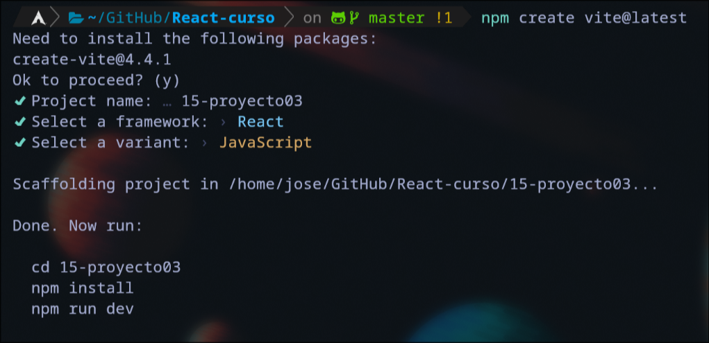

# React  

# Tabla de contenidos
- [Extensiones para VS code y el navegador](#extensiones-para-vs-code-y-el-navegador)
- [Listado de atajos con la extension VS code](#listado-de-atajos-con-la-extension-vs-code)
- [Creacion de un proyecto](#creacion-de-un-proyecto)
- [Componentes](#componentes)
- [Variables](#variables)
- [Condicionales y bucles en JSX](#condicionales-y-bucles-en-jsx)
- [Comunicacion entre componentes (props, PropTypes)](#comunicacion-entre-componentes-props-proptypes)
  - [Validacion de props (PropTypes)](#validacion-de-props-proptypes)
- [Eventos](#eventos)
- [Hook](#hook)
  - [Hook useState](#hook-usestate)
  - [Hook useEffect](#hook-useeffect)
    - [Monstar y desmonstar componentes](#monstar-y-desmonstar-componentes)
  - [Hook useRef](#hook-useref)
  - [Hook useLayoutEffect](#hook-uselayouteffect)
  - [Hook useReducer](#hook-usereducer)
  - [Hook useID](#hook-useid)
  - [Hook personalizados](#hook-personalizados)
    - [Hook personalizados para serializar Formularios](#hook-personalizado-para-serializar-formularios)
    - [Hook personalizados para peticiones con Ajax](#hook-personalizados-para-peticiones-con-ajax)
- [Peticiones Ajax (consultar una API)](#peticiones-ajax-consultar-una-api)
  - [Peticiones con Fetch](#peticiones-con-fetch)
  - [Peticiones con Async y Await](#peticiones-con-async-y-await)
  - [Efectos de carga](#efectos-de-carga)
  - [Capturar y mostar errores](#capturar-y-mostar-errores)
- [Formularios](#formularios)
- [Helpers](#helpers)
- [React Router DOM](#react-router-dom)
  - [isActive](#isactive)
  - [Enlaces SPA (fuera de un menu)](#enlaces-spa-fuera-de-un-menu)
  - [Parametros en las rutas - useParams](#parametros-en-las-rutas---useparams)
  - [Redireccionar - navigate](#redireccionar---navigate)
  - [Redireccionar - useNavigate](#redirecciones---usenavigate)
  - [Subrutas y rutas anidadas](#subrutas-y-rutas-anidadas)
- [Memorizacion en react](#memorizacion-en-react)
  - [React.memo](#reactmemo)
  - [Hook useMemo](#hook-usememo)
  - [Hook useCallback](#hook-usecallback)
- [Context](#context)
  - [Login con Context](#login-con-context)


# Extensiones para VS code y el navegador
Podemos instalar extensiones para mejorar el funcionamienot de React en nuestro entorno de desarrollo
- **[React Developer Tools](https://chrome.google.com/webstore/detail/react-developer-tools/fmkadmapgofadopljbjfkapdkoienihi?hl=es)**
- **[ES7+ React/Redux/React-Native snippets](https://marketplace.visualstudio.com/items?itemName=dsznajder.es7-react-js-snippets)**

# Listado de atajos con la extension VS code
  - rafc => Creacion de la estrucutra basica de un componente

# Creacion de un proyecto
Para poder trabajar con React, dependemos de noje.js asi que tendremos que instalarlo.   
Una vez hayamos instalado node.js nos dirijimos a una terminal
```bash
npx create-react-app proyecto
```
Si nos da algun fallo es posible que tengamos que actualizar npm 
```bash
npm install -g npm
```
Podemos iniciar el proyecto
```bash
npm start
```

## Creacion de un proyecto con Vite
```bash
npm create vite@latest
```
Con esto nos ejecuta el siguiente script  

Una vez tengamos el proyecto listo accedemos a el e instalamos las dependencias
```bash
npm install
```
Para su ejecucion
```bash
npm run dev
```
Esto puede ser un ejemplo de una estrctura de directorios en la creacion de un proyecto con vite
```bash
.
├── index.html
├── package.json
├── package-lock.json
├── public
│   ├── proyecto3.png
│   └── vite.svg
├── README.md
├── src
│   ├── App.css
│   ├── App.jsx
│   ├── assets
│   │   └── react.svg
│   ├── components
│   │   ├── layout
│   │   │   ├── Footer.jsx
│   │   │   ├── Header.jsx
│   │   │   ├── Nav.jsx
│   │   │   └── Sidebar.jsx
│   │   └── pages
│   │       ├── Article.jsx
│   │       ├── Articles.jsx
│   │       ├── Create.jsx
│   │       ├── Edit.jsx
│   │       ├── Error.jsx
│   │       ├── Home.jsx
│   │       ├── List.jsx
│   │       └── Search.jsx
│   ├── helpers
│   │   ├── Global.jsx
│   │   └── Petition.jsx
│   ├── hooks
│   │   └── useForm.js
│   ├── index.css
│   ├── main.jsx
│   └── routing
│       └── Routing.jsx
└── vite.config.js
```

# Componentes 
Un componente es una parte de la aplicacion, para ello creamos un directorio en src, donde almacenaremos los componentes que vayamos creando, lo podemos llamar componentes, y dentro de el creamos un archivo en, en mi caso lo llamare MiComponete.js (Debe ir en mayuscula siempre)
```jsx
  // Funcion del compoennt
const MiComponente = () => {
    return <p>Este es mi primer componente</p>
};

  // Exportamos el componete
export default MiComponente;
```
Si tenemos instalada la extension que he comentado anteriormente, podemos crear un componente de una manera mucha mas sencilla, con el atajo rafc  
Es decir creamos un archivo que sera nuestro componente y en el escribirmos rafc y nos generara la estrcutrua basica de un componente
```javascript
import React from 'react'

export const SegundoComponente = () => {
  return (
    <div>SegundoComponente</div>
  )
}

```
Luego cargamos el componente en el App.js
```jsx
import logo from './logo.svg';
import './App.css';
import MiComponente from './MiComponente';

function App() {
  return (
    <div className="App">
      <header className="App-header">
        
        <p>Primer proyecto</p>
        
        {/* Cargar el primer componente */}
        <MiComponente />
      </header>

    </div>
  );
}

export default App;
```
Si en un componente queremos añadir varias etiquetas HTML, que seria lo normal, tenemos varias formas de hacerlo, podemos usar un div, o un fragmento de JSX "<>"  
```jsx
const MiComponente = () => {
    return (
        <> {/* Podemos usar un <div> en vez del fragmento <></> */}
            <h2>Componente creado</h2>
            <p>Este es mi primer componente</p>
            <ul>
                <li>React</li>
                <li>Angular</li>
                <li>Vue</li>
            </ul>
        </div>
    );
};
```

# Variables
Podemos usar variables en los componentes
```jsx
const MiComponente = () => {

    const nombre = "Jose";
    let web = "www.jose.es";

    return (
        <>
            <h3>Datos del usuario:</h3>
            <ul>
                <li>Nombre: {nombre}</li>
                <li>Web: {web}</li>
            </ul>
        </>
    );
};
```
De una forma algo mas compleja, podemos usar tambien un objeto para almacenar las variables
```jsx
const MiComponente = () => {

    let usuario = {
        nombre: "Jose",
        apellidos: "Almiron Lopez",
        web: "www.jose.es"
    }

    return (
        <>
            <h3>Datos del usuario:</h3>
            <ul>
                <li>Nombre: {usuario.nombre}</li>
                <li>Apellidos: {usuario.apellidos}</li>
                <li>Web: {usuario.web}</li>
            </ul>
        </>
    );
};
```

# Condicionales y bucles en JSX
Dentro de JSX para recorrer y mostrar un elemento, tengo que tener acceso a los indices y para ello es mucho mas recomendable usar un map
```jsx
export const SegundoComponente = () => {

    const libros = ["Harry Potter", "Juego de Tronos", "Clean Code"];

    return (
        <div className='segundo-componente'>
            <h1>Listado de libros</h1>
            <ul>
              {
                  libros.map((libro, indice) => {
                      return <li key={indice}>{libro}</li>
                  })
              }
            </ul>
        </div>
    )
}
```
Si queremos un condicional para mostrar un mensaje en el caso de que no existan datos en el elemento que estamos reccoriendo
```jsx
export const SegundoComponente = () => {

    // const libros = ["Harry Potter", "Juego de Tronos", "Clean Code"];
    const libros = [];

    return (
        <div className='segundo-componente'>
            <h1>Listado de libros</h1>
            {libros.length >= 1 ? (
                <ul>
                    {
                        libros.map((libro, indice) => {
                            return <li key={indice}>{libro}</li>
                        })
                    }
                </ul>
                ) : ( <p>No hay libros</p>)
            }
        </div>
    )
}
```

# Comunicacion entre componentes (props, PropTypes)
Podemos pasar variableso o datos de un componente a otro por medio de las props
```jsx
function App() {

  const ficha_medica = {
    altura: "180cm",
    grupo: "H+",
    estado: "Bueno",
    alergias: "Ninguna"
  }

  return (
    <div className="App">
      <header className="App-header">
        <TercerComponente nombre="Jose" apellidos="Almiron" ficha={ficha_medica} />
      </header>
    </div>
  );
}
```
De esta forma tan sencilla podemos usar las props para enviar datos de un componente a otro
```jsx
export const TercerComponente = (props) => {
  return (
    <div>
        <h1>Comunicacion entre componentes</h1>
        <ul>
            <li>{ props.nombre }</li>
            <li>{ props.apellidos }</li>
            <li>{ props.ficha.estado }</li>
        </ul>
    </div>
  )
}
```
Si queremos evitar tener que estar repitiendo "props" cada vez que llamemos a una variable, podemos usar la desestructuracion de javascript de la siguiente manera quedaria mucho mas claro
```jsx
export const TercerComponente = ({nombre, apellidos, ficha}) => {
  return (
    <div>
        <h1>Comunicacion entre componentes</h1>
        <ul>
            <li>{ nombre }</li>
            <li>{ apellidos }</li>
            <li>{ ficha.estado }</li>
        </ul>
    </div>
  )
}
```

## Validacion de props (PropTypes)
Cuando hacemos uso de las props para comunicar componentes, tenemos la posbilidad de validar esas props y poner ciertos filtros, es decir que si tengo nombre asegurarme de que este sea un STring  
Podemos consultar la documentacion de [PropTypes](https://legacy.reactjs.org/docs/typechecking-with-proptypes.html)
```jsx
import React from 'react'
import PropTypes from 'prop-types'; // Esta seria la importacion

export const TercerComponente = ({nombre, apellidos, ficha}) => {
  return (
    <div>
        <h1>Comunicacion entre componentes</h1>
        <ul>
            <li>{ nombre }</li>
            <li>{ apellidos }</li>
            <li>{ ficha.estado }</li>
        </ul>
    </div>
  )
}

  // De esta forma realizamos la validacion de las props, y si son requeridas
TercerComponente.propTypes = {
  nombre: PropTypes.string.isRequired,
  apellidos: PropTypes.string.isRequired,
  ficha: PropTypes.object
}
```
Con PropsTypes podemos tambien asignar valores por defecto
```jsx
TercerComponente.propTypes = {
  // ---
}

  // Asignamos nombre y apellidos con valores por defecto, en el caso de que no reciban ningun dato
TercerComponente.defaultProps = {
  nombre: "Alberto",
  apellidos: "Martinez"
}
```

# Eventos
En react tambien tenemos los eventos que estamos acostumbrados a usar en javascript, aqui te pongo un ejemplo de los mas comunes
```jsx
import React from 'react'

export const EventosComponentes = () => {

    const handleClick = (e, nombre) => {
        alert("Has dado click al boton " + nombre)
    }

    const handleDoubleClick = () => {
        alert("Has dado doble click")
    }

    const handleEnter = (e, accion) => {
        alert(`Has ${accion} a la caja con el mouse`)
    }

    const handleFocus = e => {
        console.log("Estas dentro del input, mete tu nombre")
    }

    const handleBlur = e => {
        console.log("Estas fuera del input")
    }

    return (
        <div>
            <h1>Eventos en React</h1>
            <p>
                {/* Evento click */}
                <button onClick={e => handleClick(e, "Jose")}>Dame click!</button>
            </p>
            <p>
                {/* Evento doble click */}
                <button onDoubleClick={handleDoubleClick}>Dame doble click!</button>
            </p>
            <div id='caja' 
                onMouseEnter={e => handleEnter(e, "entrado")} 
                onMouseLeave={e => handleEnter(e, "salido")}>
                {/* Evento onMouserEnter onMouseLeave */}
                Pasa por encima!!
            </div>
            <p>
                {/* Evento onFcous onBlur */}
                <input type='text' 
                    onFocus={handleFocus} 
                    onBlur={handleBlur}
                    placeholder='introduce tu nombre' />
            </p>
        </div>
    )
}
```

# Hook
Un Hook es una funcion que te permite enganchar el estado de react y te va a permitir trabajar con el ciclo de vida de los componentes (Es una funcion que cuando pasa algo hace algo)

## Hook useState
Con el useState, podremos gestionar y actualizar el estado de un componente
```jsx
import React, { useState } from 'react'

export const MiPrimerEstado = () => {

                                // Asingmaos un valor por defecto
    const [nombre, setNombre] = useState("Jose Almiron");

        // Desde la funcion llamamos a setNombre que nos permite actualziar el estado del componente
    const cambiarNombre = e => {
        setNombre("Francisco");
    }

    return (
        <div>
            <h3>Componente: MiPrimerEstado</h3>
            <strong className='label'>{nombre}</strong>
            &nbsp; {/* Añade una pequeña separacion */}
            <button onClick={cambiarNombre}>Cambiar</button>
        </div>
    )
}
```
Aqui tenemos un ejemplo mas usando el evento onKeyUp
```jsx
import React, { useState } from 'react'

export const MiPrimerEstado = () => {

                                // Asingmaos un valor por defecto
    const [nombre, setNombre] = useState("Jose Almiron");

        // Desde la funcion llamamos a setNombre que nos permite actualziar el estado del componente
    const cambiarNombre = (e, nombreFijo) => {
        setNombre(nombreFijo);
    }

    return (
        <div>
            <h3>Componente: MiPrimerEstado</h3>
            <strong className='label'>{nombre}</strong>
            &nbsp; {/* Añade una pequeña separacion */}
            <button onClick={ e => cambiarNombre(e, "Fran") }>Cambiar nombre a Fran</button>
            &nbsp; {/* Añade una pequeña separacion */}
            <input type='text' onKeyUp={ e => cambiarNombre(e, e.target.value) } placeholder='Cambia el nombre' />
        </div>
    )
}
```

## Hook useEffect
El useEffect se utiliza para detectar y responder a cambios en el estado o en las propiedades de un componente (Permite ejecutar codigo cuando ocurren modificaciones en el componente)
```jsx
import React, { useEffect, useState } from 'react'

export const PruebasComponent = () => {

    const [usuario, setUsuario] = useState("Jose Almiron");
    const [fecha, setFecha] = useState("01-01-1998");
    const [contador, setContador] = useState(0);

    const modUsuario = e => {
        setUsuario(e.target.value);
    }

    const cambiarFecha = e => {
        setFecha(Date.now());
    }

        // Solo se ejecuta una vez, solo al cargar el componente
    useEffect(() => {
        console.log("Has cargado el componente PruebasComponent");
    }, []);

        // Se ejecuta solo se cambio el usuario
    useEffect(() => {
        setContador(contador + 1);
        console.log("Has modificado el usuario: " + contador);
    }, [fecha, usuario]);

    return (
        <div>
            <h1>El efecto - Hook useEffect</h1>
            <strong className={ contador >= 10 ? 'label label-green' : 'label' }>{ usuario }</strong>
            <strong>{ fecha }</strong>
            <p>
                <input type='text' onChange={ modUsuario } placeholder='Cambia el nombre' />
                <button onClick={ cambiarFecha }>Cambiar fecha</button>
            </p>
        </div>
    )
}
```
### Monstar y desmonstar componentes 
En este caso veremos como monstar y desmonstar componentes de React, y con esto veremos otro ejemplo del funcionamienot del useEffect
```jsx
import React, { useEffect, useState } from 'react'
import { AvisoComponent } from './AvisoComponent';

export const PruebasComponent = () => {

    const [usuario, setUsuario] = useState("Jose Almiron");
    const [contador, setContador] = useState(0);

    const modUsuario = e => {
        setUsuario(e.target.value);
    }

        // Se ejecuta solo se cambio el usuario
    useEffect(() => {
        setContador(contador + 1);
        console.log("Has modificado el usuario: " + contador);
    }, [usuario]);

    return (
        <div>
            <h1>El efecto - Hook useEffect</h1>
            <strong className={ contador >= 10 ? 'label label-green' : 'label' }>{ usuario }</strong>
            <p>
                <input type='text' onChange={ modUsuario } placeholder='Cambia el nombre' />
            </p>

            {/* Cuando el usuario sea JOSE se cargara el componente, si se elimina del input se desmontar el componente */}
            { usuario === "JOSE" && <AvisoComponent /> }
        </div>
    )
}
```
Este seria el componente que se monta y desmonta
```jsx
import React, { useEffect } from 'react'

export const AvisoComponent = () => {

    useEffect(() => {
        // Cuando el componente se monta
        alert("El componente AvisoComponent esta montado");

        // Cuando el componente se desmonta
        return () => {
            alert("COMPONENTE DESMONTADO");
        }
    }, []); // Se ejecuta una vez porque le paso el array vacio

    return (
        <div>
            <hr />
            <h3>Saludos Jose ¿Que tal estas?</h3>
            <button onClick={e => {
                alert("Bienvenido");
            }}>Mostar alerta</button>

        </div>
    )
}
```

## Hook useRef
El Hook de useRef se utiliza principalmente para acceder directamente a elementos del DOM,
con el podemos obtener los valores de un formulario, o podemos añadir clases a un div, aqui vemos dos ejemplos de lo que podemos hacer
```jsx
import React, { useRef } from 'react'

export const Formulario = () => {

    const nombre = useRef('');
    const apellidos = useRef('');
    const email = useRef('');
    const miCaja = useRef();

    const mostrar = e => {
        e.preventDefault();
        console.log(nombre.current.value);
        console.log(apellidos.current.value);
        console.log(email.current.value);

        /* mi caja */
        let { current: caja } = miCaja;
        caja.classList.add('fondoVerde');
        caja.innerHTML = 'Formulario enviado';
    }

    return (
        <div>
            <h1>Formulario</h1>

            <div ref={miCaja} className='miCaja'>
                <h2>Pruebas con useRef</h2>
            </div>

            <form onSubmit={ mostrar }>
                <input type="text" ref={nombre} placeholder="Nombre" /><br />
                <input type="text" ref={apellidos} placeholder="Apellidos" /><br />
                <input type="email" ref={email} placeholder="Correo electronico" /><br />

                <input type="submit" value="Enviar" />
            </form>
        </div>
    )
}
```
```jsx

```

## Hook useLayoutEffect
Es practicamnete el mismo metodo que el useEffect, pero con la diferencia se ejecuta de manera asincrona despues de hacer todas las renderizaciones en el DOM

## Hook useReducer
Es una hook que se utiliza para gestionar el estado de un componente de una manera mas organizada y controlada que el hook "useState"  
```jsx
export const JuegoReducer = (state = [], action) => {

    switch (action.type) {
        case "crear":
            return [...state, action.payload];
        case "borrar":
            return state.filter(juego => juego.id !== action.payload);
        case "editar":
            let indice = state.findIndex(juego => juego.id === action.payload.id);
            state[indice] = action.payload;
            return [...state];
        default:
            return state;
    }

}
```
```jsx
import React, { useEffect, useReducer } from 'react'
import { JuegoReducer } from '../reducers/JuegoReducer';

const init = () => {
    return JSON.parse(localStorage.getItem('juegos')) || [];
}

export const MisJuegos = () => {

    const [juegos, dispatch] = useReducer(JuegoReducer, [], init);

    useEffect(() => {
        localStorage.setItem('juegos', JSON.stringify(juegos));
    }, [juegos]);

    const conseguirDatosForm = e => {
        e.preventDefault();

        let juego = {
            id: new Date().getTime(),
            titulo: e.target.titulo.value,
            descripcion: e.target.descripcion.value
        };

        const action = {
            type: 'crear',
            payload: juego
        };

        dispatch(action);
    }

    const borrar = id => {
        const action = {
            type: 'borrar',
            payload: id
        };

        dispatch(action);
    }

    const editar = (e, id) => {
        let juego = {
            id,
            titulo: e.target.value,
            descripcion: e.target.value
        };

        const action = {
            type: 'editar',
            payload: juego
        };

        dispatch(action);
    }

    return (
        <div>
            <h1>Estos son mis videojuegos</h1>

            <p>Numero de videojuegos: { juegos.length }</p>

            <ul className='lista'>
                {
                    juegos.map(juego => (
                        <li key={juego.id}>
                            { juego.titulo }
                            &nbsp;
                            <button onClick={e => borrar(juego.id)}>X</button>
                            &nbsp;
                            <input type='text' onBlur={e => editar(e, juego.id)} />
                        </li>
                    ))
                }
            </ul>

            <h3>Agregar juego</h3>

            <form onSubmit={conseguirDatosForm}>
                <input type='text' name='titulo' placeholder='Titulo' />
                <textarea name='descripcion' placeholder='Descripcion' />
                <input type='submit' value='Guardar' />
            </form>
        </div>
    )
}

```

## Hook useID
Con useID podemos generar identificadores unicos
```jsx
import React, { useId } from 'react'

export const MiComponente = () => {

  const id = useId();

  return (
    <div>
      <h1>Hook useID</h1>
      <p>El id generado es: "{id}"</p>
    </div>
  )
}

```

## Hook personalizados 
Podemos crear nuestros propios hooks personalizados y de esta forma evitar repetir mismas funciones en distintos componentes, este seria un ejemplo de como funciona
```jsx
import { useState } from "react";

export const useMayus = (texto) => {

    const [miTexto, setMiTexto] = useState(texto);

    const mayusculas = () => {
        return setMiTexto(texto.toUpperCase());
    }

    const minusculas = () => {
        return setMiTexto(texto.toLowerCase());
    }

    const add = (added) => {
        return setMiTexto(texto += added);
    }

    return {
        estado: miTexto,
        mayusculas,
        minusculas,
        add
    };
}
```
```jsx
import React from 'react';
import { useMayus } from '../hooks/useMayus'

export const PruebasCustom = () => {
    

    const { estado, mayusculas, minusculas, add } = useMayus("Jose Almiron");

    return (
        <div>
            <h1>Probando componentes personalizados</h1>
            <h2>{estado}</h2>
            &nbsp;
            <button onClick={mayusculas}>Mayusculas</button>
            &nbsp;
            <button onClick={minusculas}>Minusculas</button>
            &nbsp;
            <button onClick={e => add(" - Probando hooks personalizados")}>Añadir</button>
        </div>
    )
}

```

### Hook personalizado para serializar formularios
Este hook lo podemos llamar useForm y nos puede ayudar a la hora de trabajar con formularios
```jsx
import { useState } from "react";

export const useForm = (objetoInicial = {}) => {

    const [formulario, setFormulario] = useState(objetoInicial);

    const serializarFormulario = (formulario) => {
        const formData = new FormData(formulario);

        const objetoCompleto = {};

        for (let [name, value] of formData) {
            objetoCompleto[name] = value;
        }
        return objetoCompleto;
    }

    const enviado = (e) => {
        e.preventDefault();
        let curso = serializarFormulario(e.target);
        setFormulario(curso);
    }

    const cambiado = ({ target }) => {
        const { name, value } = target;

        setFormulario({
            ...formulario,
            [name]: value
        });
    }

    return {
        formulario,
        enviado,
        cambiado
    }
}

```
```jsx
import React from 'react'
import { useForm } from '../hooks/useForm'

export const MiFormulario = () => {

    const { formulario, enviado, cambiado } = useForm({});

    return (
        <div>
            <h1>Formulario</h1>
            <p>Formulario para guardar un curso</p>
            <p>Curso guardado: {formulario.titulo}</p>
            <pre className='codigo'>{JSON.stringify(formulario)}</pre>

            <form className='mi-formulario' onSubmit={enviado}>
                <input type='text' name='titulo' onChange={cambiado} placeholder='Titulo:' />
                <input type='number' name='year' onChange={cambiado} placeholder='Año Publicacion' />
                <textarea name='descripcion' onChange={cambiado} placeholder='Año publicacion' />
                <input type='text' name='autor' onChange={cambiado} placeholder='Autor:' />
                <input type='email' name='email' onChange={cambiado} placeholder='Correo de contacto:' />

                <input type='submit' value="Enviar" />
            </form>
        </div>
    )
}

```

### Hook personalizados para peticiones con Ajax

```jsx
import { useEffect, useState } from "react";

export const useAjax = (url) => {

    const [estado, setEstado] = useState({
        datos: null,
        cargando: true
    });

    useEffect(() => {
        getData();
    }, [url]);

    const getData = async() => {
        setEstado({
            ...estado,
            cargando: true
        });
        const peticion = await fetch(url);
        const { data } = await peticion.json();
        setEstado({
            datos: data,
            cargando: false
        });
    }

    return {
        datos: estado.datos,
        cargando: estado.cargando
    }
}

```
```jsx
import React, { useState } from 'react'
import { useAjax } from '../hooks/useAjax';

export const MiUsuario = () => {

    const [url, setUrl] = useState("https://reqres.in/api/users/1");
    const {datos, cargando} = useAjax(url);

    const getId = e => {
        setUrl(`https://reqres.in/api/users/${e.target.value}`);
    }

    return (
        <div>
            <h1>Mi usuario:</h1>
            <p>Datos del usuario</p>
            <p>{cargando ? "Cargando..." : ""}</p>
            <p>{datos?.first_name} {datos?.last_name}</p>
            <input type='number' name='id' onChange={getId} />
        </div>
    )
}

```

# Peticiones Ajax (consultar una API)
Vamos a ver varias maneras de hacer peticiones s una API desde react

## Peticiones con Fetch
```jsx
import React, { useEffect, useState } from 'react'

export const AjaxComponent = () => {

    const [usuarios, setUsuarios] = useState([]);

    const getUsuariosAjaxPms = () => {
        fetch("https://reqres.in/api/users?page=1")
            .then(respuesta => respuesta.json())
            .then(
                resultado_final => {
                    setUsuarios(resultado_final.data);
                    console.log(usuarios);
                },
                error => {
                    console.log(error);
                }
            );
    }

    useEffect(() => {
        getUsuariosAjaxPms();
    }, []); // Para evitar que se ejecute siempre que haya un cambio en el componente, le añadimos un array vacio

    return (
        <div>
            <h2>Listado de usuarios via Ajax</h2>
            <ol className='usuarios'>
                {
                    usuarios.map(usuario => {
                        console.log(usuario);
                        return <li key={usuario.id}>{`${usuario.first_name} ${usuario.last_name}`}</li>
                    })
                }
            </ol>
        </div>
    )
}
```

## Peticiones con Async y Await
```jsx
import React, { useEffect, useState } from 'react'

export const AjaxComponent = () => {

    const [usuarios, setUsuarios] = useState([]);

    const getUsuariosAjazAW = async() => {
        try {
            const peticion = await fetch("https://reffdsaqres.in/api/users345?page=1");
            const {data} = await peticion.json();        

            setUsuarios(data);
        } catch (error) {
            console.log(error.message);
        }
    }


    useEffect(() => {
        getUsuariosAjazAW();
    }, []); // Para evitar que se ejecute siempre que haya un cambio en el componente, le añadimos un array vacio

    return (
        <div>
            <h2>Listado de usuarios via Ajax</h2>
            <ol className='usuarios'>
                {
                    usuarios.map(usuario => {
                        console.log(usuario);
                        return <li key={usuario.id}>{`${usuario.first_name} ${usuario.last_name}`}</li>
                    })
                }
            </ol>
        </div>
    )
}
```

## Efectos de carga
Para el efecto seria tan sencillo como crear un useState, para controlar cuando mostarlo y cuando no, y tener un condicional en el return. En este caso he puesto solo un texto pero podria ponerse una animacion
```jsx
/* eslint-disable jsx-a11y/alt-text */
import React, { useEffect, useState } from 'react'

export const AjaxComponent = () => {

    const [usuarios, setUsuarios] = useState([]);
    const [loading, setLoading] = useState(true);

    const getUsuariosAjazAW = () => {
        // Le podemos poner tamibien un diley a la peticion
        setTimeout(async() => {
            const peticion = await fetch("https://reqres.in/api/users?page=1");
            const {data} = await peticion.json();
    
            setUsuarios(data);
            setLoading(false);
        }, 2000);
    }

    useEffect(() => {
        getUsuariosAjazAW();
    }, []); // Para evitar que se ejecute siempre que haya un cambio en el componente, le añadimos un array vacio


    if (loading === true) {
        return (
            <div className='cargando'>Cargando datos...</div>
        )
    } else {
            // Cuando todo va bine
        return (
            <div>
                <h2>Listado de usuarios via Ajax</h2>
                <ol className='usuarios'>
                    {
                        usuarios.map(usuario => {
                            return (
                                <li key={usuario.id}>
                                    
                                    &nbsp;
                                    {`${usuario.first_name} ${usuario.last_name}`}
                                </li>
                            );
                        })
                    }
                </ol>
            </div>
        )
    }

}
```

## Capturar y mostar errores
```jsx
/* eslint-disable jsx-a11y/alt-text */
import React, { useEffect, useState } from 'react'

export const AjaxComponent = () => {

    const [usuarios, setUsuarios] = useState([]);
    const [loading, setLoading] = useState(true);
    const [error, setError] = useState('');

    const getUsuariosAjazAW = () => {
        setTimeout(async() => {
            try {
                const peticion = await fetch("https://reffdsaqres.in/api/users345?page=1");
                const {data} = await peticion.json();
        
                setUsuarios(data);
                setLoading(false);
            } catch (error) {
                console.log(error.message);
                setError(error.message);
            }
        }, 2000);
    }

    useEffect(() => {
        getUsuariosAjazAW();
    }, []); // Para evitar que se ejecute siempre que haya un cambio en el componente, le añadimos un array vacio


    if (error !== "") {
            // Cuando algun error
        return (
            <div className='errores'>{ error }</div>
        )
    } else if (loading === true) {
            // Cuando esta todo cargando
        return (
            <div className='cargando'>Cargando datos...</div>
        )
    } else if (loading === false && error === "") {
            // Cuando todo va bine
        return (
            <div>
                <h2>Listado de usuarios via Ajax</h2>
                <ol className='usuarios'>
                    {
                        usuarios.map(usuario => {
                            return (
                                <li key={usuario.id}>
                                    
                                    &nbsp;
                                    {`${usuario.first_name} ${usuario.last_name}`}
                                </li>
                            );
                        })
                    }
                </ol>
            </div>
        )
    }

}
```

# Formularios
Con el evento onSubmit podemos enviar datos de un formulario y almacenarlos en un estado
```jsx
import React, { useState } from 'react'

export const FormularioComponent = () => {

    const [usuario, setUsuario] = useState({});

    const conseguirDatosFormulario = e => {
        e.preventDefault();

        let datos = e.target;
        let usuario = {
            nombre: datos.nombre.value,
            apellidos: datos.apellidos.value,
            genero: datos.genero.value,
            bio: datos.biografia.value
        }
        setUsuario(usuario);
    }

    return (
        <div>
            <h1>Formularios en Reac</h1>

            { usuario.bio && usuario.bio.length >= 1 && (
                <div className='info_usuario label label-gray'>
                    { usuario.nombre } { usuario.apellidos } es un { usuario.genero } y su biografia es esta: <p>{ usuario.bio }</p>
                </div>
            )}

            <form onSubmit={ conseguirDatosFormulario }>
                <input type='text' placeholder='Nombre' name='nombre' />
                <input type='text' placeholder='Apellidos' name='apellidos' />
                <select name='genero'>
                    <option value="hombre">Hombre</option>
                    <option value="mujer">Mujer</option>
                </select>
                <textarea placeholder='biografia' name='biografia'></textarea>

                <input type='submit' value="Enviar" />
            </form>
        </div>
    )
}
```
Sigueineod el ejemplo anterior, podemos hacer que si se modifican los datos del fromulario estos se actualicen de forma dinamica, con un onChange en cada input 
```jsx
    // De esta forma podemos hacer que al modificar un campo del formulario su estado se actualice automaticamanete
    const cambiarDatos = e => {
        let name_del_input = e.target.name;

        setUsuario(estado_previo => {
            return {
                ...estado_previo, 
                [name_del_input]: e.target.value 
            }
        });
    }

    return (
        <div>
            <h1>Formularios en Reac</h1>

            { usuario.bio && usuario.bio.length >= 1 && (
                <div className='info_usuario label label-gray'>
                    { usuario.nombre } { usuario.apellidos } es un { usuario.genero } y su biografia es esta: <p>{ usuario.bio }</p>
                </div>
            )}

            <form onSubmit={ conseguirDatosFormulario }>
                <input type='text' placeholder='Nombre' name='nombre' onChange={ cambiarDatos } />
                <input type='text' placeholder='Apellidos' name='apellidos' onChange={ cambiarDatos } />
                <select name='genero' onChange={ cambiarDatos }>
                    <option value="hombre">Hombre</option>
                    <option value="mujer">Mujer</option>
                </select>
                <textarea placeholder='biografia' name='bio' onChange={ cambiarDatos }></textarea>

                <input type='submit' value="Enviar" />
            </form>
        </div>
    )
```

# Helpers
Los "helpers" en React son funciones o servicios que se pueden reutilizar en distintos componentes para evitar la repeticion de codigo y mejorar la modularidad de la aplicacion. Estas funciones auxiliares encapsulan logica común o tareas específicas para hacer que el codigo sea mas limpio y mantenible  
Para trabajar con ellos creamos un nuevo directorio en src, llamado helpers, y un ejemplo de una funcionalidad que puede ser reutilizable es la gestion del localStorage
```jsx
export const guardarEnStorage = (key, item) => {
    // Conseguir los elementos que ya tenemos en el localStorage
    let items = JSON.parse(localStorage.getItem(key));

    // Comprobar si es un array
    if (Array.isArray(items)) {
        // Añadir dentro del array un elemento nuevo
        items.push(item);
    } else {
        // Crear un array con el nuevo elemento
        items = [item];
    }

    // Guardar en el localStorage
    localStorage.setItem(key, JSON.stringify(items));

    // Devolver objeto guardado
    return item;
}
```
Para usar la funcionalidad solo tendremos que llamar al helper y este se importara automaticmanete
```jsx
import { guardarEnStorage } from '../helpers/GuardarEnStorage';

guardarEnStorage("pelis", peli);
```

# React Router DOM
Lo primero que tenemos que hace es instalar el paquete de react router dom, con el siguiente comando en consola
```jsx
npm install react-router-dom
```
A la hora de trabajar con rutas en react, tendremos el directorio de "components", y otro directorio llamado "router", en este nuevo directorio crearemos el componente que se encargara de gestionar las rutas
```jsx
import React from 'react'
import { Routes, Route, NavLink, BrowserRouter } from 'react-router-dom';
import { Inicio } from '../components/Inicio';
import { Contacto } from '../components/Contacto';
import { Articulos } from '../components/Articulos';
import { Error } from '../components/Error';

export const RouterPrincipal = () => {
    return (
        <BrowserRouter>
            <nav>
                <ul>
                    <li><NavLink to="/inicio">Inicio</NavLink></li>
                    <li><NavLink to="/contacto">Contacto</NavLink></li>
                    <li><NavLink to="/articulos">Articulos</NavLink></li>
                </ul>
            </nav>
            <hr />

            <section className='contenido_principal'>
                {/* Cargar componentes */}
                {/* Aqui se carga el componente que coincida con el path */}
                <Routes>
                    <Route path="/" element={<Inicio />} />
                    <Route path="/inicio" element={<Inicio />} />
                    <Route path="/contacto" element={<Contacto />} />
                    <Route path="/articulos" element={<Articulos />} />
                    <Route path='*' element={<Error />} />
                </Routes>
            </section>
        </BrowserRouter>
    )
}
```
Y lo llamaremos desde el App
```jsx
import './App.css';
import { RouterPrincipal } from './routers/RouterPrincipal';

function App() {
  return (
    <RouterPrincipal />
  );
}

export default App;
```

## isActive
Si queremos ponerle algun estilo CSS en el menu al enlace que corresponda al componennte donde nos encontramos, podemos usar el "isActive" y con una funcion de collback añadirle una clase
```jsx
<nav>
    <ul>
        <li><NavLink to="/inicio" className={({isActive}) => isActive ? "activado" : ""}>Inicio</NavLink></li>
        <li><NavLink to="/contacto" className={({isActive}) => isActive ? "activado" : ""}>Contacto</NavLink></li>
        <li><NavLink to="/articulos" className={({isActive}) => isActive ? "activado" : ""}>Articulos</NavLink></li>
    </ul>
</nav>
```

## Enlaces SPA (fuera de un menu)
Estos enlaces pueden ser interesantes, por ejemplo en la pagina de error para volver a la pagina principla, se usa cuando solo se necesita un enlace
```jsx
import React from 'react'
import { Link } from 'react-router-dom'

export const Error = () => {
  return (
    <div>
        <h1>Error 404</h1>
        <p>Esta es la pagina de error</p>
        <Link to="/">Volver al inicio</Link>
    </div>
  )
}
```

## Parametros en las rutas - useParams
Podemos mandar parametros por medio de unan url, gracias al Hook useParams
```jsx
<BrowserRouter>
    {/* Cargar componentes */}
    {/* Aqui se carga el componente que coincida con el path */}
    <Routes>
        <Route path="/" element={<Inicio />} />
        <Route path="/inicio" element={<Inicio />} />
        <Route path="/contacto" element={<Contacto />} />
        <Route path="/articulos" element={<Articulos />} />
        {/* De esta forma podemos mandar parametros */}
        <Route path="/personas/:nombre" element={<Personas />} />
        <Route path='*' element={<Error />} />
    </Routes>
</BrowserRouter>
```
Y desde el componente podemos llamarlo gracias al useParams
```jsx
import React from 'react'
import { useParams } from 'react-router-dom'
export const Personas = () => {

    const { nombre } = useParams();

    return (
        <div>
            <h1>Pagina de Personas: { nombre }</h1>
            <p>Esta es la pagina de personas</p>
        </div>
    )
}
```
Estos parametros son obligatorios, si queremos que sean opcionales tendremos que duplicar las rutas sin esos parametros
```jsx
<BrowserRouter>
    {/* Cargar componentes */}
    {/* Aqui se carga el componente que coincida con el path */}
    <Routes>
        <Route path="/" element={<Inicio />} />
        <Route path="/inicio" element={<Inicio />} />
        <Route path="/contacto" element={<Contacto />} />
        <Route path="/articulos" element={<Articulos />} />
        {/* De esta forma podemos mandar parametros */}
        <Route path="/personas/:nombre/:apellido" element={<Personas />} />
        <Route path="/personas/:nombre" element={<Personas />} />
        <Route path="/personas" element={<Personas />} />
        <Route path='*' element={<Error />} />
    </Routes>
</BrowserRouter>
```
De esta forma ya no seran obligatorios los parametros y ya no nos mostrara la pagina de 404 en caso de que no tengan ningun valor esos parametros, tambien podemos añadirles valores por defecto
```jsx
import React from 'react'
import { useParams } from 'react-router-dom'
export const Personas = () => {

    let { nombre = '"usuario"', apellido='"apellido"' } = useParams();

    return (
        <div>
            <h1>Pagina de Personas: { nombre} { apellido }</h1>
            <p>Esta es la pagina de personas</p>
        </div>
    )
}
```
Otra forma de hacerlo es con un condicional
```jsx
import React from 'react'
import { useParams } from 'react-router-dom'
export const Personas = () => {

    // Valores por defecto en parametros opcionales
    // let { nombre = '"usuario"', apellido='"apellido"' } = useParams();

    const { nombre, apellido } = useParams();

    return (
        <div>
            {!nombre && <h1>No hay ninguna persona que mostrar</h1>}
            {nombre && (
                <>
                    <h1>Pagina de Personas: { nombre} { apellido }</h1>
                    <p>Esta es la pagina de personas</p>
                </>
            )}
        </div>
    )
}
```

## Redireccionar - Navigate
Para hacer redirecciones a otras rutas, usamos el componente "Navigate"
```jsx
<Route path="/redirigir" element={<Navigate to="/personas/Jose/Almiron"/>} />
```

## Redirecciones - useNavigate
Tambien podemos usar el Hokk useNavigate para hacer redirecciones
```jsx
import React from 'react'
import { useNavigate, useParams } from 'react-router-dom'
export const Personas = () => {

    // Valores por defecto en parametros opcionales
    // let { nombre = '"usuario"', apellido='"apellido"' } = useParams();

    const { nombre, apellido } = useParams();
    const navegar = useNavigate();

    const enviar = e => {
        e.preventDefault();
        let nombre = e.target.nombre.value;
        let apellido = e.target.apellido.value;
        let url = `/personas/${nombre}/${apellido}`;

        if (nombre.length <= 0 && apellido.length <= 0) {
            navegar("/inicio");
        } else if (nombre === "contacto") {
            navegar("/contacto");
        } else {
            navegar(url);
        }
        
    }

    return (
        <div>
            {!nombre && <h1>No hay ninguna persona que mostrar</h1>}
            {nombre && <h1>Pagina de Personas: {nombre} {apellido}</h1>}

            <p>Esta es la pagina de personas</p>

            <form onSubmit={ enviar }>
                <input type="text" name="nombre" />
                <input type="text" name="apellido" />
                <input type="submit" name="enviar" value="Enviar" />
            </form>
        </div>
    )
}
```

## Subrutas y rutas anidadas
Para poder realizar subrutas cambiaremos el enlace que las contiene de esta forma
```jsx
<BrowserRouter>
    {/* Cargar componentes */}
    {/* Aqui se carga el componente que coincida con el path */}
    <Routes>
        <Route path="/" element={<Inicio />} />
        <Route path="/inicio" element={<Inicio />} />
        <Route path="/contacto" element={<Contacto />} />
        <Route path="/articulos" element={<Articulos />} />
        {/* De esta forma podemos mandar parametros */}
        <Route path="/personas/:nombre" element={<Personas />} />
        De esta forma estamos especificando que panel tendra mas rutas
        <Route path="/panel/*" element={<PanelControl />}>
            <Route index element={<InicioPanel />} />
            <Route path='inicio' element={<InicioPanel />} />
            <Route path='crear-articulos' element={<Crear />} />
            <Route path='gestion-usuarios' element={<Gestion />} />
            <Route path='acerca-de' element={<Acerca />} />
        </Route>
        <Route path='*' element={<Error />} />
    </Routes>
</BrowserRouter>
```
Y desde el componente que nos hemos creado para almacenar las subrutas en este caso panel de control, llamaremos al componente "Outlet" con el que podremos llamar a los componentes
```jsx
import React from 'react'
import { NavLink, Outlet } from 'react-router-dom'

export const PanelControl = () => {
  return (
    <div>
        <h1>Panel de control</h1>
        <p>Elige una de estas opciones</p>
        <nav>
            <ol>
                <li><NavLink to='/panel/inicio'>Inicio</NavLink></li>
                <li><NavLink to='/panel/crear-articulos'>Crear articulos</NavLink></li>
                <li><NavLink to='/panel/gestion-usuarios'>Gestion de usuarios</NavLink></li>
                <li><NavLink to='/panel/acerca-de'>Acerca de</NavLink></li>
            </ol>
        </nav>

        <div>
            {/* Quiero cargar aqui los componentes de las subrutas */}
            <Outlet />
        </div>
    </div>
  )
}
```

# Memorizacion en react 
Es una funcion de optimizacion en React que se utiliza para memorizar el resultado de un componente funcional. Su objetivo principal es evitar la renderizacion innecesaria de un componente cuando sus props no han cambiado.  

## React.memo
```jsx
import React, { useEffect, useState } from 'react'

export const Empleados = React.memo(({ pagina }) => {

    const [empleados, setEmpleados] = useState([]);

    useEffect(() => {
        getEmpleados(pagina);
    }, [pagina]);

    const getEmpleados = async(pagina) => {
        try {
            const peticion = await fetch(`https://reqres.in/api/users?page=${pagina}`);
            const {data} = await peticion.json();        

            setEmpleados(data);
        } catch (error) {
            console.log(error.message);
        }
    }

    return (
        <div>
            <p>Mostando pagina: { pagina }</p>
            <ol className='usuarios'>
                {
                    empleados.map(empleado => {
                        return <li key={empleado.id}>{`${empleado.first_name} ${empleado.last_name}`}</li>
                    })
                }
            </ol>
        </div>
    )
});
```
Con este ejemplo vemos que la lista de empleados, solo se renderizara cuando haya algun cambio, como que cambie la props pagina
```jsx
import React, { useEffect, useState } from 'react'
import { Empleados } from './Empleados'

export const Gestion = () => {

    const [nombre, seNombre] = useState('');
    const [pagina, setPagina] = useState(1);

    const asignarGestor = e => {
        seNombre(e.target.value);
    }

    return (
        <div>
            <h1>Nombre del gestor: { nombre }</h1>

            <h2>Listado de empleados</h2>
            <input type='text' onChange={asignarGestor} placeholder='Nombre del gestor' />
            <p>Los usuarios son gestionados por: { nombre } vienen de jsonplaceHolder...</p>
            <button onClick={ () => setPagina(1) }>Pagina 1</button> 
            <button onClick={ () => setPagina(2) }>Pagina 2</button>
            {/* si pagina no cambia el componente solo se renderizara al cargar el componente */}
            <Empleados pagina={pagina} />
        </div>
    )
}
```

## Hook useMemo
En el caso de que tengamos una funcion que puede tardar, por que tiene muchos datos que porcesar, en vez de evitar que se renderize el componente una sola vez, podemos usar el hook usememo que nos permite hacer lo mismo pero en funciones
```jsx
import React, { useMemo, useState } from 'react'

export const Tareas = () => {

    const [tareas, setTareas] = useState([]);
    const [contador, setContador] = useState(30);

    const guardarTareas = e => {
        e.preventDefault();
        setTareas([...tareas, e.target.descripcion.value]);
        e.target.descripcion.value = '';
    }

    const borrar = id => {
        /* Filtar las tareas para eliminar la que nno quiero */
        let nuevas_tareas = tareas.filter((tarea, index) => index !== id);
        /* Set State, guardar el nuevo listado de tareas en el estado */
        setTareas(nuevas_tareas);
    }

    const sumar = () => {
        setContador(contador + 1);
    }

    const contadoresPasados = (acumulacion) => {
        for (let i = 0; i <= acumulacion; i++) {
            console.log("Ejecutando acumulacion de contadores del pasado...");
        }
        return `Contador manual de tareas: ${ contador }`;
    }

    /* De esta manera la funcion se ejecutara solo al cargar el componente, y cuando haya cambios en el contador */
    /* pero no le afectara el resto de tareas como añador o eliminar una tarea */
    const memoContadores = useMemo(() => contadoresPasados(contador), [contador]);

    return (
        <div className='tareas-container'>
            <h1>Mis tareas</h1>
            <form onSubmit={guardarTareas}>
                <input type='text' name='descripcion' placeholder='describe la tarea' />
                <input type='submit' value='Agregar' />
            </form>

            <h3>{ memoContadores }</h3>
            <button onClick={sumar}>Sumar</button>

            <h3>Listado de tareas</h3>
            <ul>
                {
                    tareas.map((tarea, index) => {
                        return (
                            <li key={index}>
                                {tarea}
                                &nbsp;
                                <button onClick={ () => borrar(index) }>X</button>
                            </li>
                        );
                    })
                }
            </ul>
        </div>
    )
}

```

## Hook useCallback
con useCallbak tambine podremos hacer algo similar al usermemo, esta funcion solo se renderizara una vez o cuando haya alguna moidifcacion en pagina
```jsx
const mostarMensaje = useCallback(() => {
    console.log("Hola que tal soy un mensaje desde el componente Empleados!!");
}, [pagina]);
```

# Context
El context nos permite enviar informacion entre componentes cuando usamos rutas. Para trabajar con ellos se suele crear un directorio donde iran todos los context
```jsx
import { createContext } from "react";

/* De esta manera se crea un context */
export const PruebaContext = createContext(null);
```
Tenemos que envolver los componentes donde queramos compartir la informacion, en este caso todos
```jsx
import './App.css';
import { PruebaContext } from './context/PruebaContext';
import { AppRouter } from './routing/AppRouter';

function App() {

  const curso = {
    id: 1,
    titulo: "Curso de React",
    contenido: "Muchas horas de contenido y aprendizaje"
  };

  return (
    <div className="App">
    {/* Con el value le asignmaos la informacion a compartir como se haria con las props */}
      <PruebaContext.Provider value={curso}>
        <AppRouter />
      </PruebaContext.Provider>
    </div>
  );
}

export default App;
```
```jsx
import React, { useContext } from 'react'
import { PruebaContext } from '../context/PruebaContext';

export const Inicio = () => {

  /* Con useContext accemos al contenido que estamos compartiendo */
  const compartida = useContext(PruebaContext);
  console.log(compartida);

  return (
    <div>
      <h1>Inicio</h1>
      <p>Pagina de inicio</p>
      <p>Valor compartido: <strong>{ compartida.titulo }</strong></p>
    </div>
  )
}
```

## Login con context
Gracias al useContext podemos realizar un login, este seria un ejemplo de como hacerlo 
```jsx
import { createContext } from "react";

/* De esta manera se crea un context */
export const PruebaContext = createContext(null);
```
```jsx
import { useEffect, useState } from 'react';
import './App.css';
import { PruebaContext } from './context/PruebaContext';
import { AppRouter } from './routing/AppRouter';

function App() {

  const [usuario, setUsuario] = useState({});

  useEffect(() => {
    /* La primera vez que se carga el componente */
    let user = JSON.parse(localStorage.getItem("user"))
    setUsuario(user);
  }, []);

  useEffect(() => {
    /* Cada vez que se actualiza el estado usuario se guarda en el localStorage */
    localStorage.setItem("user", JSON.stringify(usuario));
  }, [usuario]);

  return (
    <div className="App">
      {/* Con el value le asignmaos la informacion a compartir como se haria con las props */}
      <PruebaContext.Provider value={{ usuario, setUsuario }}>
        <AppRouter />
      </PruebaContext.Provider>
    </div>
  );
}

export default App;
```
```jsx
import React, { useContext } from 'react'
import { PruebaContext } from '../context/PruebaContext';

export const Login = () => {

  const { usuario, setUsuario } = useContext(PruebaContext);

  const login = e => {
    e.preventDefault();

    let user = {
      id: new Date().getTime(),
      nombre: e.target.nombre.value,
      apellidos: e.target.apellidos.value,
      correo: e.target.correo.value
    };

    setUsuario(user);
  }

  return (
    <div>
      <h1>Login</h1>
      <p>Pagina de login</p>

      <form className='login' onSubmit={login}>
        <input type='text' name='nombre' placeholder='nombre' />
        <input type='text' name='apellidos' placeholder='apellidos' />
        <input type='email' name='correo' placeholder='correo' />
        <input type='submit' value='Enviar' />
      </form>
    </div>
  )
}
```
```jsx
import React, { useContext } from 'react'
import { Routes, Route, NavLink, BrowserRouter } from 'react-router-dom';
import { Inicio } from '../components/Inicio';
import { Articulos } from '../components/Articulos';
import { Contacto } from '../components/Contacto';
import { Error } from '../components/Error';
import { Acerca } from '../components/Acerca';
import { Login } from '../components/Login';
import { PruebaContext } from '../context/PruebaContext';

export const AppRouter = () => {

    const { usuario, setUsuario } = useContext(PruebaContext);

    return (
        <BrowserRouter>
            <header className='header'>
                <nav>
                    <div className='logo'>
                        <h2>Aprendiendo React Context</h2>
                    </div>
                    <ul>
                        <li><NavLink to="/inicio">Inicio</NavLink></li>
                        <li><NavLink to="/articulos">Articulos</NavLink></li>
                        <li><NavLink to="/acerca-de">Acerca de</NavLink></li>
                        <li><NavLink to="/contacto">Contacto</NavLink></li>
                        {usuario.hasOwnProperty("nombre") && usuario.nombre !== null ? (
                            <>
                                <li>
                                    <NavLink to="/">{usuario.nombre}</NavLink>
                                </li>
                                <li>
                                    <a href='#/' onClick={e => {
                                        e.preventDefault();
                                        setUsuario({});
                                    }}>Cerrar sesion</a>
                                </li>
                            </>
                        ) : (
                            <li>
                                <NavLink to="/login">Login</NavLink>
                            </li>
                        )}
                    </ul>
                </nav>
            </header>

            <section className='content'>
                {/* Cargar componentes */}
                {/* Aqui se carga el componente que coincida con el path */}
                <Routes>
                    <Route path="/" element={<Inicio />} />
                    <Route path="/inicio" element={<Inicio />} />
                    <Route path="/articulos" element={<Articulos />} />
                    <Route path="/acerca-de" element={<Acerca />} />
                    <Route path="/contacto" element={<Contacto />} />
                    <Route path="/login" element={<Login />} />
                    <Route path='*' element={<Error />} />
                </Routes>
            </section>
        </BrowserRouter>
    )
}
```


```jsx

```
```jsx

```
```jsx

```
```jsx

```
