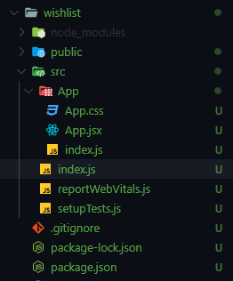
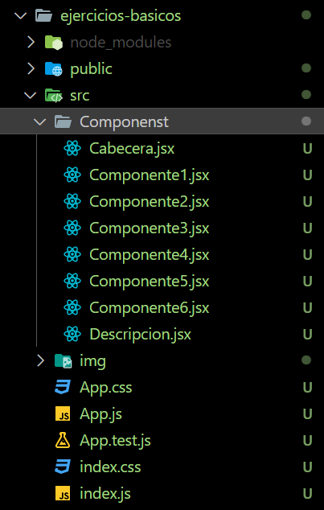
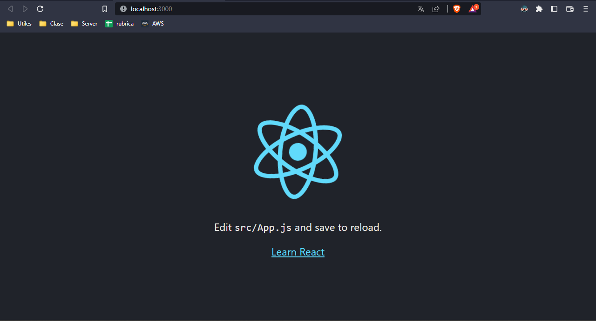

# React 

# Tabla de contenidos
- [Creacion de un proyecto](#creacion-de-un-proyecto)
- [Como crear un compoennte en jsx](#componentes-en-jsx)
- [PropTypes](#proptypes)
- [Hooks UseState](#hooks-usestate)
- [Hooks UseEffect](#hooks-useeffect)
- [React Router](#react-router)
- [Consultar APIS](#consultar-apis)

# Creacion de un proyecto

Para la creacion de un proyecto React necesitaremos node y por consola introducimos 
```powershell
npx create-react-app my-app
```
Esto nos generara el proyecto, podemos trabajar de dos formas, podemos crear un directorio llamado App y en ella copiaremos los ficheros que empiecen por App como muestra la imagen  
  
De esta forma en el index.js llamaremos al componente App
```javascript
import App from './App';
<React.StrictMode>
    <App />
</React.StrictMode>
```
Por cada componente que hagamos como en el App tendremos un fichero index.js en el que siempre sera igual importamos el componente y lo exportamos. Cada componente sera un directorio nuevo con index.js y el compoente.jsx
```javascript
import App from "./App";

export default App;
```
Tendremos otro fichero con el nombre del componente en el que ira toda la funcionalidad del componente, en este caso App.jsx
```javascript
import React from 'react';

const App = () => <h1>Hola mundo</h1>

export default App;
```
Otra forma de trabajar con react seria crear un directorio compoents en el que iran todos los jsx, en el App.js Realizaremos las llamadas a los componentes y desde el index.js hariamos la importacion de App como en el caso anterior  
  
Para iniciar el proyecto React
```powershell
npm start
```


# Componentes en jsx

React funciona con componentes creados en jsx, la forma de crear un componente seria la siguiente 
```javascript
const h1 = () => <h1>Hola mundo</h1>;
```
Para instanciar el componente que hemos creado
```javascript
<h1 />
```

# PropTypes

Permite especificar como van a ser nuestras propiedades, nos permite tener un mismo componente como un h2 y poder asignarle diferentes valores
```javascript
npm install -save prop-types
```
Un ejemplo para trabajar con propstypes, podemos asignarle un valor por defecto y que el campo sea requerido
```javascript
import React from 'react';
import PropTypes from 'prop-types'

const Cabecera = (props) => {
    const texto = props.texto;
    return (<h2> {texto} </h2>);
}
    // Asignamos que su valor es obligatorio
Cabecera.propTypes = {
    texto: PropTypes.string.isRequired,
}
    // Le asigna un valor por defecto
Cabecera.defaultProps = {
    texto: 'Componente'
}

export default Cabecera;
```
La llamada al componente seria asignando un valor
```javascript
import Cabecera from "./Cabecera";

<Cabecera texto={"Componente 1"}/>
```

# Hooks UseState
Permite usar el estado en componentes funcionales, en este caso false es el valor por defecto que tendra el componente al renderizarse 
```javascript
import { useState } from "react";

cont componente = () => {
    const [checked, setchecked] = useState(false);
    return (
        <p onClick={() => setchecked(!checked)}>
            {checked ? 'si' : 'no'} 
        </p>
    );
};
```

# Hooks UseEffect

Un efecto en react es codigo que se ejecuta despues del render, funcion que recibe como primer parametro un callback, dentro de ella realizamos las acciones que responderan a los diferentes eventos
```javascript
import React from "react";
import { useEffect } from "react";
import { useState } from "react";
import Cabecera from "./Cabecera";
import Descripcion from "./Descripcion";

const Componente1 = () => {
    const [color, setColor] = useState("white");
    useEffect(() => {
        document.body.style.backgroundColor = color;
    }, [color])
    return (
        <>
            <Cabecera texto={"Componente 1"}/>
            <Descripcion texto={"Crear un componente que contenga un botón. Al pulsar dicho botón se cambiará el fondo de la pantalla a un color #abb8c3"}/>
            <button onClick={() => color === "white" ? setColor("#abb8c3") : setColor("white")}>Cambiar Color</button>
        </>
    );
}
```

# React Router

Enrutando desde el lado cliente, lo primero que haremos sera instalar el paquete necesario
```powershell
npm install react-router-dom
```
Desde el index.js del proyecto, al usar las rutas ya no usaremos el App.js
```javascript
import {
  createBrowserRouter,
  RouterProvider,
} from "react-router-dom";

const router = createBrowserRouter([
  {
    path: "/",
    element: <Usuario />,
    errorElement: <Error />,
  },
  {
    path: "Posts/:userid",
    element: <Posts />,
  },
]);

const root = ReactDOM.createRoot(document.getElementById('root'));
root.render(
  <>
  <React.StrictMode>
    <RouterProvider router={router} />
  </React.StrictMode>
  </>
);
```
Lo siguiente que haremos sera crear un directorio Routes, donde iran nuestros componentes, es decir ya no usaremos un componente global App o un directorio components, si no que trabajaramos en este directorio  
Para trabajar con enlaces, normalmente usariamos la etiqueta a de html, pero en este caso usaremos link, ejemplo de como seria un menu usando rutas
```javascript
import { Link } from 'react-router-dom';

const Nav = () => {
    return(
        <nav>
            <ul>
                <li>
                    <Link to={`/`}>Usuarios</Link>
                </li>
            </ul>
        </nav>
    );
}
```
Podemos personalizar las paginas de error como la de 404
```javascript
import { useRouteError } from "react-router-dom";

const Error = () => {

    const error = useRouteError();
    console.error(error);

    return (
        <div id="error-page">
            <h1>Oops!</h1>
            <p>Sorry, an unexpected error has occurred.</p>
            <p>
                <i>{error.statusText || error.message}</i>
            </p>
        </div>
    );
}
```

# Consultar APIS

Para consultar APIS usaremos una funcion fetchDatos en la que haremos la llamda a la API, si nos devuelve varios valores deberemos recorrerlos con un mamp
```javascript
const [usuario, setUsuario] = useState([]);

    useEffect(() => {
        fetchDatos();
    }, []);

    const fetchDatos = async () => {
        try {
            const url = "https://jsonplaceholder.typicode.com/users";
            const respuesta = await fetch(url);
            const json = await respuesta.json();
            setUsuario(json);
        }
        catch (error) {
            console.log("error: " + error);
        }
    }
    return (
        <>
        <Nav />
        <ol>
            {usuario.map(user => (
                <li key={user.id}>
                    <Link to={`/Posts/${user.id}`}>{user.name}</Link>
                </li>
            ))}
        </ol>
        </>
    );
```
```javascript

```
```javascript

```
```javascript

```